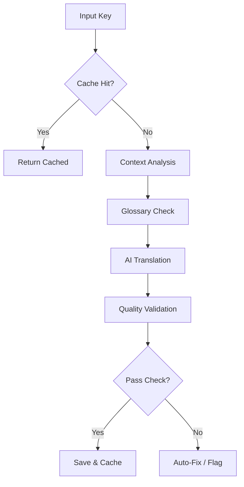

# Core Concepts

Locai is more than just a wrapper around an API; it contains several intelligent systems to ensure human-quality localization.

## Translation Pipeline

Locai processes every key through a robust pipeline to ensure quality and consistency.

## 1. Infinite Memory (Vector Cache)

LocAI uses vector embeddings to store every translation it generates. When translating a new key, it checks if similar content has been translated before to maintain consistency across your application.

## Deep Context (Source Code Analysis)

Unlike traditional tools that only see the key and value, LocAI scans your source code (TypeScript/TSX) to understand **where** and **how** a string is used.

It extracts:

- **Component Name**: Knowing it's in a `DeleteModal` vs `SuccessToast` changes the tone.
- **Comments**: Reads comments like `// context: shown to admin users`.
- **Props**: Analyzes JSX props (e.g., `variant="danger"`) to infer urgency or style.

This rich context is sent to the AI, resulting in significantly more accurate translations.

## 2. Smart Synchronization

Instead of translating every file from scratch, Locai maintains a content graph.

**Example:**

- You have 500 keys.
- You add 3 new keys and change 1 existing key.
- Locai detects this and only sends **4 requests** to the AI, not 504.

## 3. Confidence Scoring & Quality Checks

Locai calculates a **Confidence Score (0.0 - 1.0)**. It also performs automated checks to prevent broken apps.

### Example: Quote Balance Fix

Locai detects when an AI generates invalid JSON (missing quotes) and fixes it automatically.

**Scenario:**

- Source: `"Part 2: 'Go to settings'"`
- Bad Translation: `"Bölüm 2: 'Ayarlara git"` (Missing closing quote)
- **Locai Auto-Fix**: `"Bölüm 2: 'Ayarlara git'"`

## 4. Glossary Support

Ensure brand consistency by defining immutable terms.

### Before/After

**Without Glossary:**

> Source: "Welcome to the **Locai Dashboard**."
> Translation: "Locai Gösterge Paneline hoş geldiniz." (Generic translation)

**With Glossary:**

> Configuration: `glossary: { "Dashboard": "Kontrol Merkezi" }`
> Translation: "Locai **Kontrol Merkezi**ne hoş geldiniz." (Brand consistent)

## 5. Context Awareness

Locai helps the AI understand _what_ it is translating.

- **UI Mode**: "Home" -> "Ana Sayfa" (Button)
- **Real Estate Mode**: "Home" -> "Ev" (House)
